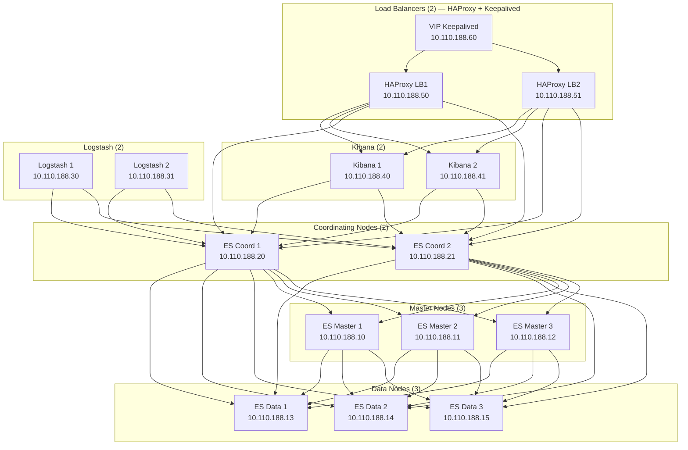

# ELK HA Cluster — Automated Deployment Project

## Overview

Deploy a **production-grade, highly available ELK stack** (Elasticsearch 9.4.1, Logstash 9.4.1, Kibana 9.4.1) on **Proxmox VE** (hosted on CloudStack datacenter) using **Terraform** for infrastructure provisioning and **Ansible** for configuration management.

**14 VMs total** across 6 node types, with full TLS encryption, RBAC, load balancing, snapshots, ILM, and resilience testing.

---

## Current Infrastructure State

- **Hyperviseur** : Proxmox VE installé sur un datacenter CloudStack
- **Proxmox Web UI** : https://10.110.188.77:8006
- **Authentification** : Linux PAM (`@pam`)
- **API Token Terraform** : `terraform@pam!terraform-token`
- **Template VM** : Ubuntu 22.04 cloud-init — VM ID `9000`, nom `ubuntu-22.04-template` ✅ créé
- **Storage** : `local-lvm` (tous les VMs, OS + données)
- **Bridge réseau** : `vmbr0` (pas de VLAN dédié)
- **Réseau** : `10.110.188.0/22`, Gateway : `10.110.188.1`
- **Clé SSH** : `~/.ssh/elk_key` (privée) / `~/.ssh/elk_key.pub` (publique), user : `ubuntu`
- **Snapshots** : filesystem local, chemin `/mnt/snapshots`
- **VMs actuelles** : aucune

---

## Architecture Diagram



---

## IP Plan

| VM             | Rôle               | IP               |
|----------------|--------------------|------------------|
| es-master-01   | ES Master          | 10.110.188.10    |
| es-master-02   | ES Master          | 10.110.188.11    |
| es-master-03   | ES Master          | 10.110.188.12    |
| es-data-01     | ES Data            | 10.110.188.13    |
| es-data-02     | ES Data            | 10.110.188.14    |
| es-data-03     | ES Data            | 10.110.188.15    |
| es-coord-01    | ES Coordinating    | 10.110.188.20    |
| es-coord-02    | ES Coordinating    | 10.110.188.21    |
| logstash-01    | Logstash           | 10.110.188.30    |
| logstash-02    | Logstash           | 10.110.188.31    |
| kibana-01      | Kibana             | 10.110.188.40    |
| kibana-02      | Kibana             | 10.110.188.41    |
| lb-01          | HAProxy/Keepalived | 10.110.188.50    |
| lb-02          | HAProxy/Keepalived | 10.110.188.51    |
| —              | VIP Keepalived     | 10.110.188.60   |

---

## VM Sizing

| Rôle            | Count | vCPU | RAM  | Disque | Heap JVM |
|-----------------|-------|------|------|--------|----------|
| ES Master       | 3     | 2    | 4 GB | 20 GB  | 2 GB     |
| ES Data         | 3     | 2    | 6 GB | 50 GB  | 3 GB     |
| ES Coordinating | 2     | 2    | 2 GB | 10 GB  | 1 GB     |
| Logstash        | 2     | 2    | 3 GB | 10 GB  | —        |
| Kibana          | 2     | 2    | 2 GB | 10 GB  | —        |
| Load Balancer   | 2     | 1    | 1 GB | 5 GB   | —        |

> Heap JVM = 50% RAM sur tous les nœuds Elasticsearch.

---

## Stack Versions

| Composant          | Version      |
|--------------------|--------------|
| Elasticsearch      | 9.4.1        |
| Logstash           | 9.4.1        |
| Kibana             | 9.4.1        |
| Metricbeat         | 9.4.1        |
| Auditbeat          | 9.4.1        |
| Filebeat           | 9.4.1        |
| Heartbeat          | 9.4.1        |
| OS                 | Ubuntu 22.04 LTS |
| Terraform provider | bpg/proxmox ~> 0.78 |
| Ansible            | >= 2.14      |

---

## Elasticsearch Cluster Configuration

- **3 master-eligible nodes** (quorum = 2)
- **Séparation stricte des rôles** : master / data / coordinating
- **Réplication** : 1 replica par shard (1 original + 1 copie)
- **TLS** : activé sur transport layer ET HTTP layer
- **RBAC** : utilisateurs dédiés (kibana_system, logstash_writer)
- **Swap** : désactivé sur toutes les VMs
- **vm.max_map_count** : 262144
- **Audit log ES** : activé (`xpack.security.audit.enabled: true`)
- Audit log Kibana : activé (`xpack.security.audit.enabled: true`)
---

## Project File Structure

```
elk-infra/
├── README.md
├── docs/
│   ├── architecture.md
│   ├── installation-guide.md
│   ├── troubleshooting.md
│   └── runbooks/
│       ├── failover-procedures.md
│       └── restore-procedures.md
│       └── security-audit.md 
├── terraform/
│   ├── main.tf
│   ├── providers.tf
│   ├── variables.tf
│   ├── terraform.tfvars
│   ├── outputs.tf
│   ├── versions.tf
│   └── modules/
│       └── proxmox-vm/
│           ├── main.tf
│           ├── variables.tf
│           └── outputs.tf
├── ansible/
│   ├── ansible.cfg
│   ├── inventory/
│   │   ├── hosts.yml
│   │   ├── group_vars/
│   │   │   ├── all.yml
│   │   │   ├── elasticsearch.yml
│   │   │   ├── es_masters.yml
│   │   │   ├── es_data.yml
│   │   │   ├── es_coordinating.yml
│   │   │   ├── kibana.yml
│   │   │   ├── logstash.yml
│   │   │   ├── loadbalancers.yml
│   │   │   ├── auditbeat.yml                        
│   │   │   ├── filebeat.yml                         
│   │   │   └── heartbeat.yml                        
│   │   └── host_vars/
│   │       ├── es-master-01.yml
│   │       ├── es-master-02.yml
│   │       ├── es-master-03.yml
│   │       ├── es-data-01.yml
│   │       ├── es-data-02.yml
│   │       ├── es-data-03.yml
│   │       ├── es-coord-01.yml
│   │       ├── es-coord-02.yml
│   │       ├── logstash-01.yml
│   │       ├── logstash-02.yml
│   │       ├── kibana-01.yml
│   │       ├── kibana-02.yml
│   │       ├── lb-01.yml
│   │       └── lb-02.yml
│   ├── playbooks/
│   │   ├── site.yml
│   │   ├── 00-prerequisites.yml
│   │   ├── 01-elasticsearch.yml
│   │   ├── 02-kibana.yml
│   │   ├── 03-logstash.yml
│   │   ├── 04-haproxy.yml
│   │   ├── 05-security.yml
│   │   ├── 06-post-deploy.yml
│   │   ├── 07-snapshot-ilm.yml
│   │   └── 08-security-audit.yml
│   └── roles/
│       ├── common/
│       │   ├── tasks/main.yml
│       │   ├── handlers/main.yml
│       │   ├── templates/
│       │   │   ├── hosts.j2
│       │   │   ├── sysctl.conf.j2
│       │   │   └── limits.conf.j2
│       │   └── files/
│       ├── elasticsearch/
│       │   ├── tasks/main.yml
│       │   ├── handlers/main.yml
│       │   ├── templates/
│       │   │   ├── elasticsearch.yml.j2
│       │   │   ├── jvm.options.j2
│       │   │   └── elasticsearch.service.j2
│       │   ├── files/
│       │   │   └── elasticsearch.repo
│       │   └── vars/main.yml
│       ├── security/
│       │   ├── tasks/main.yml
│       │   ├── templates/
│       │   │   ├── instances.yml.j2
│       │   │   └── setup-passwords.sh.j2
│       │   └── files/
│       ├── kibana/
│       │   ├── tasks/main.yml
│       │   ├── handlers/main.yml
│       │   ├── templates/
│       │   │   └── kibana.yml.j2
│       │   └── vars/main.yml
│       ├── logstash/
│       │   ├── tasks/main.yml
│       │   ├── handlers/main.yml
│       │   ├── templates/
│       │   │   ├── logstash.yml.j2
│       │   │   ├── pipelines.yml.j2
│       │   │   ├── pipeline.conf.j2
│       │   │   └── filebeat-audit-pipeline.conf.j2
│       │   └── vars/main.yml
│       ├── haproxy/
│       │   ├── tasks/main.yml
│       │   ├── handlers/main.yml
│       │   ├── templates/
│       │   │   ├── haproxy.cfg.j2
│       │   │   └── keepalived.conf.j2
│       │   └── files/
│       ├── metricbeat/
│       │   ├── tasks/main.yml
│       │   ├── handlers/main.yml
│       │   └── templates/
│       │       └── metricbeat.yml.j2
│       ├── auditbeat/                               
│       │   ├── tasks/main.yml
│       │   ├── handlers/main.yml
│       │   └── templates/
│       │       └── auditbeat.yml.j2
│       ├── filebeat/                               
│       │   ├── tasks/main.yml
│       │   ├── handlers/main.yml
│       │   └── templates/
│       │       ├── filebeat.yml.j2
│       │       └── filebeat-modules.d/
│       │           ├── system.yml.j2
│       │           ├── elasticsearch.yml.j2
│       │           ├── kibana.yml.j2
│       │           ├── logstash.yml.j2
│       │           └── haproxy.yml.j2
│       ├── heartbeat/                               
│       │   ├── tasks/main.yml
│       │   ├── handlers/main.yml
│       │   └── templates/
│       │       └── heartbeat.yml.j2
│       └── snapshot/
│           ├── tasks/main.yml
│           └── templates/
│               ├── create-snapshot-repo.sh.j2
│               └── snapshot-cron.sh.j2
├── scripts/
│   ├── deploy.sh
│   ├── generate-certs.sh
│   ├── setup-passwords.sh
│   └── tests/
│       ├── test-resilience.sh
│       ├── test-master-failover.sh
│       ├── test-data-node-failure.sh
│       ├── test-kibana-failover.sh
│       ├── test-logstash-failover.sh
│       ├── test-snapshot-restore.sh
│       ├── test-cluster-health.sh
│       ├── test-audit-events.sh                    
│       ├── test-filebeat-kibana-logs.sh             
│       └── test-heartbeat-uptime.sh    
└── .gitignore
```

---

## Phase 1: Terraform Infrastructure

### providers.tf
- Provider `bpg/proxmox ~> 0.78`
- Endpoint : `https://10.110.188.77:8006`
- Token : `terraform@pam!terraform-token`
- `insecure = true` (certificat auto-signé Proxmox)

### versions.tf
- Terraform >= 1.5
- Provider versions pinned

### variables.tf
- Toutes les specs VMs paramétrées (CPU, RAM, disque, IP)
- Variables de connexion Proxmox
- Variables réseau et SSH

### terraform.tfvars
- Valeurs concrètes pour les 14 VMs
- IPs selon le plan ci-dessus
- Storage : `local-lvm`
- Bridge : `vmbr0`
- Gateway : `10.110.188.1`
- Masque : `/22`
- Template VM ID : `9000`
- Node Proxmox : `proxmox-elk`

### main.tf
- Appels de module pour chaque groupe de VMs
- Utilise le module réutilisable `proxmox-vm`

### modules/proxmox-vm/
- Module réutilisable : clone, cloud-init, réseau, disque
- Injection clé SSH via cloud-init

---

## Phase 2: Ansible — Rôle Common

- Désactivation swap
- Tuning sysctl (`vm.max_map_count`, file descriptors)
- Limites système (`ulimits`)
- Installation des prérequis (curl, gnupg, apt-transport-https)
- Ajout dépôt Elastic APT 9.x
- Configuration NTP
- Mise à jour `/etc/hosts` pour résolution interne
- Configuration firewall UFW

---

## Phase 3: Elasticsearch

### Rôle elasticsearch
- Installation Elasticsearch 9.4.1
- Configuration `elasticsearch.yml` selon le rôle (master / data / coordinating)
- JVM heap = 50% RAM
- `discovery.seed_hosts` : masters 10.110.188.10/11/12
- `cluster.initial_master_nodes` : es-master-01/02/03
- `number_of_replicas: 1` (1 original + 1 copie)
- Override systemd
- Limites file descriptors et mmap
- **Audit log activé** dans `elasticsearch.yml.j2` :
  ```yaml
  xpack.security.audit.enabled: true
  xpack.security.audit.outputs: [index, logfile]
  ```

### Rôle security
- Génération CA + certificats nœuds via `elasticsearch-certutil`
- Distribution certificats sur tous les nœuds ES
- TLS transport layer + HTTP layer
- Configuration utilisateurs built-in (kibana_system, logstash_writer)
- RBAC : rôles dédiés avec principe du moindre privilège
- Mots de passe stockés dans Ansible Vault

---

## Phase 4: Kibana

### Rôle kibana
- Installation Kibana 9.4.1
- HTTPS avec certificats TLS
- Connexion à ES via nœuds coordinating (10.110.188.20/21)
- Credentials `kibana_system`
- Clés de chiffrement activées
- **Audit log activé** dans `kibana.yml.j2` :
  ```yaml
  xpack.security.audit.enabled: true
  xpack.security.audit.ignore_filters:
    - actions: [space_find]
  ```

---

## Phase 5: Logstash

### Rôle logstash
- Installation Logstash 9.4.1
- `logstash.yml` : pipeline workers, batch size
- Pipeline principale : input Beats (5044) → filter (json, date, mutate) → output ES
- **Pipeline dédié audit** `filebeat-audit-pipeline.conf` :
  ```
  input { beats { port => 5044 } }
  filter {
    if [event][module] == "kibana" {
      useragent { source => "[kibana][access][agent]" target => "user_agent" }
      geoip     { source => "source.ip" }
    }
    if [event][module] == "system" {
      mutate { add_field => { "audit.type" => "system_auth" } }
    }
    if [event][module] == "elasticsearch" {
      mutate { add_field => { "audit.type" => "es_access" } }
    }
  }
  output {
    elasticsearch {
      hosts    => ["https://10.110.188.20:9200", "https://10.110.188.21:9200"]
      index    => "filebeat-%{[event][module]}-%{+YYYY.MM.dd}"
      ssl      => true
      cacert   => "/etc/logstash/certs/ca.crt"
      user     => "logstash_writer"
      password => "${LOGSTASH_PASSWORD}"
    }
  }
  ```
- TLS output vers Elasticsearch
- Credentials `logstash_writer`
- Dead letter queue activé

---

## Phase 6: Load Balancer

### Rôle haproxy
- Installation HAProxy
- Frontend/backend Kibana (port 5601)
- Frontend/backend ES coordinating (port 9200)
- Health checks sur tous les backends
- Sessions persistantes pour Kibana
- Page stats HAProxy activée

### Keepalived
- VIP : `10.110.188.60`
- lb-01 : MASTER, lb-02 : BACKUP
- Failover automatique

---

## Phase 7: Monitoring & Audit de Sécurité

### Rôle metricbeat
- Installation Metricbeat 9.4.1 sur tous les nœuds
- Module Elasticsearch activé
- Module system activé
- Output vers cluster Elasticsearch (coordinating nodes)
- TLS configuré
- Dashboards Kibana importés automatiquement

### Rôle auditbeat 

**Version** : `9.4.1`

**Installé sur** : tous les nœuds (ES Master ×3, Data ×3, Coordinating ×2, Logstash ×2, Kibana ×2, LB ×2)

**Objectif** : audit complet des accès système, modifications de fichiers critiques, authentifications, changements d'utilisateurs et commandes exécutées au niveau du kernel Linux.

#### Modules activés

| Module | Ce qu'il capture |
|--------|-----------------|
| `auditd` | Appels système Linux via le kernel audit framework (execve, open, connect, chmod…) |
| `file_integrity` | Modifications de fichiers critiques (lecture, écriture, suppression, renommage) |
| `system` | Logins/logouts, changements d'utilisateurs, processus créés, sockets réseau ouverts |

#### Informations collectées par événement

- `user.name` / `user.id` — utilisateur qui a effectué l'action
- `source.ip` — IP source de la connexion SSH
- `process.executable` / `process.args` — commande exécutée
- `file.path` / `file.action` — fichier modifié + type de modification
- `event.action` — nature de l'événement (login, file_modified, process_started…)
- `@timestamp` — horodatage précis

### Rôle filebeat 

**Version** : `9.4.1`

**Installé sur** : tous les nœuds (14 VMs)

**Objectif** : collecte et parsing des logs applicatifs et système pour tracer les accès Kibana (IP, browser, user-agent), les requêtes Elasticsearch, les connexions SSH, et tous les événements d'authentification.

#### Modules activés

| Module Filebeat | Logs collectés | Ce qu'on obtient |
|-----------------|---------------|-----------------|
| `system` | `/var/log/auth.log`, `/var/log/syslog` | SSH logins, sudo, PAM, IP source, user |
| `elasticsearch` | `gc.log`, `server.log`, `audit.log` | Requêtes ES, auth RBAC, erreurs, user |
| `kibana` | `kibana.log` | Accès UI Kibana, user connecté, IP, browser |
| `logstash` | `logstash-plain.log` | Pipeline errors, accès API monitoring |
| `haproxy` | `/var/log/haproxy.log` | IP clients, backend sélectionné, status HTTP |


### Rôle heartbeat

**Version** : `9.4.1`

**Installé sur** : `lb-01` (10.110.188.50) et `lb-02` (10.110.188.51) uniquement

**Objectif** : surveillance de disponibilité (uptime) de tous les services du cluster avec détection immédiate de toute panne de service.

#### Moniteurs configurés

| Service surveillé | Protocole | Endpoint | Intervalle |
|-------------------|-----------|----------|------------|
| ES Coordinating 1 | HTTPS | `https://10.110.188.20:9200` | 10s |
| ES Coordinating 2 | HTTPS | `https://10.110.188.21:9200` | 10s |
| ES Master 1 | TCP | `10.110.188.10:9300` | 30s |
| ES Master 2 | TCP | `10.110.188.11:9300` | 30s |
| ES Master 3 | TCP | `10.110.188.12:9300` | 30s |
| ES Data 1 | TCP | `10.110.188.13:9200` | 30s |
| ES Data 2 | TCP | `10.110.188.14:9200` | 30s |
| ES Data 3 | TCP | `10.110.188.15:9200` | 30s |
| Kibana 1 | HTTPS | `https://10.110.188.40:5601` | 15s |
| Kibana 2 | HTTPS | `https://10.110.188.41:5601` | 15s |
| Logstash 1 | TCP | `10.110.188.30:5044` | 15s |
| Logstash 2 | TCP | `10.110.188.31:5044` | 15s |
| VIP HAProxy | HTTPS | `https://10.110.188.60:5601` | 10s |

### Récapitulatif déploiement des Beats

| Beat | Version | Nœuds cibles | Index ES |
|------|---------|--------------|----------|
| Metricbeat | 9.4.1 | Tous (14) | `metricbeat-9.4.1-*` |
| Auditbeat | 9.4.1 | Tous (14) | `auditbeat-9.4.1-*` |
| Filebeat | 9.4.1 | Tous (14) | `filebeat-{module}-*` |
| Heartbeat | 9.4.1 | lb-01, lb-02 | `heartbeat-9.4.1-*` |
---

## Phase 8: Snapshots & ILM

### Rôle snapshot
- Repository filesystem local : `/mnt/snapshots`
- Politique snapshot : quotidienne
- Rétention : 7 snapshots journaliers + 4 hebdomadaires
- Cron automatisé

### ILM (configuré dans le rôle elasticsearch)
- **Hot** : 7 jours
- **Warm** : 30 jours (force merge 1 segment)
- **Cold** : 90 jours
- **Delete** : 365 jours

---

## Phase 9: Tests de résilience & Documentation

### Scripts de test
- `test-cluster-health.sh` — Vérifier statut GREEN du cluster
- `test-master-failover.sh` — Arrêter un master, vérifier nouvelle élection
- `test-data-node-failure.sh` — Arrêter un data node, vérifier réallocation shards
- `test-kibana-failover.sh` — Arrêter Kibana, vérifier bascule LB
- `test-logstash-failover.sh` — Arrêter Logstash, vérifier continuité ingestion
- `test-snapshot-restore.sh` — Créer snapshot, supprimer index, restaurer
- `test-resilience.sh` — Lancer tous les tests séquentiellement
- `test-audit-events.sh` — Vérifier que les événements Auditbeat arrivent dans ES
- `test-filebeat-kibana-logs.sh` — Vérifier que les accès Kibana sont loggués avec IP + browser
- `test-heartbeat-uptime.sh` — Vérifier l'uptime de tous les services via Heartbeat

### Documentation
- `README.md` — Vue d'ensemble, quickstart, architecture
- `docs/installation-guide.md` — Guide de déploiement pas à pas
- `docs/architecture.md` — Documentation architecture détaillée
- `docs/troubleshooting.md` — Problèmes courants et solutions
- `docs/runbooks/failover-procedures.md` — Procédures de failover
- `docs/runbooks/restore-procedures.md` — Procédures de restauration
- `docs/runbooks/security-audit.md` — Procédures de consultation des logs d'audit (rechercher un user, tracer une IP, voir les modifications de fichiers, analyser les browsers)


## Phase 10: Alerting & Automatisation des Alertes

### Objectif
Détecter automatiquement :

incidents sécurité,

comportements anormaux,

pannes services,

erreurs critiques,

puis générer des alertes centralisées dans Kibana.

### Sources des alertes 

| Source | Type d’événements|
|-------------------|-------------------|
| Metricbeat | CPU, RAM, disque, réseau|
| Auditbeat | Commandes, accès système, modifications fichiers|
| Filebeat | Logs SSH, Kibana, Elasticsearch, HAProxy|
| Heartbeat | Disponibilité et uptime services|

### Alertes configurables

| Alerte | Condition|
|-------------------|-------------------|
| SSH Bruteforce |> 10 échecs login en 1 minute|
| Service DOWN |Heartbeat détecte indisponibilité|
| Modification fichier critique |/etc/passwd, /etc/sudoers, configs ELK|
| CPU/RAM élevé |Utilisation > 90%
Accès Kibana suspect	IP inconnue ou navigateur anormal
Multiples erreurs 401/403	Tentatives accès refusées

### Affichage des alertes

Les alertes sont visibles dans :

Kibana → Alerts

Kibana → Observability

Kibana → Security   

Dashboards personnalisés

### Actions possibles

| Action | Description|
|-------------------|-------------------|
| Notification Kibana | notification directe dans Kibana|
| Email | envoie d'emails aux destinataires configurés|
| Slack | notifications Slack selon les configurations|
| Microsoft Teams | envoie de messages vers Microsoft Teams|
| Webhook HTTP | envoie de notifications HTTP vers une URL externe|
| Index Elasticsearch dédié | envoie de notifications vers un index Elasticsearch dédié|

### Automatisation des alertes avec Ansible

#### Nouveau rôle

```
ansible/roles/alerting/
├── tasks/
│   └── main.yml
├── templates/
│   ├── ssh-bruteforce-alert.json.j2
│   ├── heartbeat-service-down.json.j2
│   ├── cpu-high-alert.json.j2
│   └── file-integrity-alert.json.j2
└── vars/
    └── main.yml
```

#### Nouveau playbook

```
ansible/playbooks/09-alerting.yml
```

#### Ajout dans site.yml

```
- import_playbook: 09-alerting.yml
```

### Rôle du playbook alerting

Création automatique des règles Kibana

Création des connectors (email, Slack…)

Import automatique des alertes sécurité

Déploiement reproductible sans configuration manuelle

Microsoft Teams

Webhook HTTP

Index Elasticsearch dédié

Automatisation des alertes avec Ansible

## Nouveau rôle

```
ansible/roles/alerting/
├── tasks/
│   └── main.yml
├── templates/
│   ├── ssh-bruteforce-alert.json.j2
│   ├── heartbeat-service-down.json.j2
│   ├── cpu-high-alert.json.j2
│   └── file-integrity-alert.json.j2
└── vars/
    └── main.yml

## Nouveau playbook

```
ansible/playbooks/09-alerting.yml
```

Ajout dans site.yml :

```
- import_playbook: 09-alerting.yml
```

### Rôle du playbook alerting

Création automatique des règles Kibana

Création des connectors (email, Slack…)

Import automatique des alertes sécurité

Déploiement reproductible sans configuration manuelle

### Fonctionnement

Ansible utilise les APIs REST Kibana pour :

créer les règles d’alertes,

configurer les seuils,

définir les actions automatiques,

associer les index Elasticsearch.

---

## Verification Plan

### Tests automatisés

1. `terraform validate` et `terraform plan`
2. `ansible-playbook --syntax-check` sur tous les playbooks
3. `ansible-lint` sur tous les rôles
4. Lancer la suite de tests de résilience

### Vérifications manuelles
1. Santé cluster ES : `curl -k -u elastic:PASSWORD https://10.110.188.20:9200/_cluster/health`
2. Liste des nœuds : `curl -k -u elastic:PASSWORD https://10.110.188.20:9200/_cat/nodes?v`
3. Kibana via load balancer : `https://10.110.188.60:5601`
4. Test pipeline Logstash : envoyer un message syslog test
5. Vérifier TLS sur toutes les connexions
6. Vérifier RBAC avec différents rôles utilisateurs
7. Vérifier snapshots : `curl -k -u elastic:PASSWORD https://10.110.188.20:9200/_snapshot/_all`
8. Vérifier Metricbeat dashboards dans Kibana
9. Vérifier Auditbeat : `curl -k -u elastic:PASSWORD https://10.110.188.20:9200/auditbeat-*/_count`
10. Vérifier Filebeat Kibana logs dans Discover → index `filebeat-kibana-*` → filtrer sur `source.ip`, `user.name`, `user_agent.name` 
11. Vérifier Filebeat system logs → index `filebeat-system-*` → filtrer sur `event.action: ssh_login`
12. Vérifier Heartbeat Uptime : Kibana → Observability → Uptime
13. Vérifier audit ES activé : `curl -k -u elastic:PASSWORD https://10.110.188.20:9200/_xpack/usage` → champ `security.audit.enabled: true`

---

## Ce que l'audit permet de tracer

| Besoin | Source | Index Elasticsearch |
|--------|--------|-------------------|
| Qui s'est connecté à Kibana, depuis quelle IP, quel navigateur | Filebeat module `kibana` | `filebeat-kibana-*` |
| Quelles actions ont été faites dans Kibana (dashboard, query…) | Kibana Audit Log → Filebeat `kibana` | `filebeat-kibana-*` |
| Qui a modifié un fichier de conf ES/Kibana/Logstash | Auditbeat `file_integrity` | `auditbeat-*` |
| Quelles commandes ont été exécutées sur les nœuds | Auditbeat `auditd` | `auditbeat-*` |
| Qui a fait `sudo`, depuis quel compte | Filebeat module `system` (`auth.log`) | `filebeat-system-*` |
| Connexions SSH avec IP source et résultat | Filebeat module `system` (`auth.log`) | `filebeat-system-*` |
| Quelles requêtes ES ont été faites par quel user | ES Audit Log → Filebeat `elasticsearch` | `filebeat-elasticsearch-*` |
| Tentatives d'accès refusées (403, EACCES) | Auditbeat `auditd` + Filebeat `elasticsearch` | `auditbeat-*`, `filebeat-elasticsearch-*` |
| Quel service est tombé, à quelle heure | Heartbeat | `heartbeat-*` |
| Trafic HTTP passant par HAProxy (IP client, status) | Filebeat module `haproxy` | `filebeat-haproxy-*` |

---

## Contraintes & Bonnes Pratiques

| Contrainte                                   | Statut |
|----------------------------------------------|--------|
| Aucun déploiement VM manuel                  | ✅ Terraform uniquement |
| Infrastructure reproductible from scratch    | ✅ |
| TLS transport + HTTP                         | ✅ |
| RBAC + moindre privilège                     | ✅ |
| Heap JVM = 50% RAM                           | ✅ |
| Swap désactivé                               | ✅ |
| 3 master-eligible nodes                      | ✅ |
| Réplication = 1                              | ✅ |
| HAProxy + Keepalived HA                      | ✅ |
| Snapshots automatisés                        | ✅ |
| ILM configuré                               | ✅ |
| Monitoring Metricbeat                        | ✅ |
| Auditbeat — audit kernel + fichiers          | ✅ Tous les nœuds |
| Filebeat — logs Kibana (IP + browser + user) | ✅ Tous les nœuds |
| Filebeat — audit log ES + Kibana activé      | ✅ |
| Heartbeat — uptime monitoring tous services  | ✅ lb-01 / lb-02 |
| Traçabilité complète user / IP / action      | ✅ |


NB: Tout doit etre automatisé.